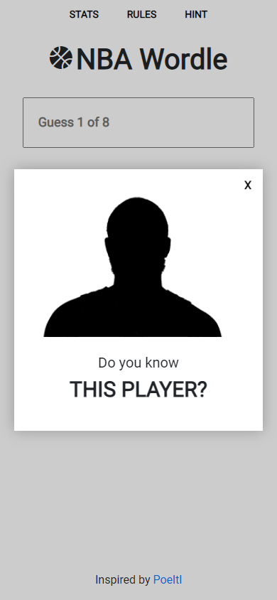
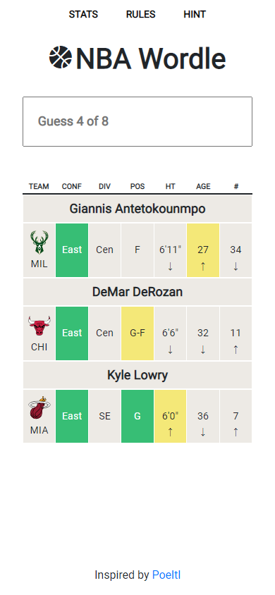
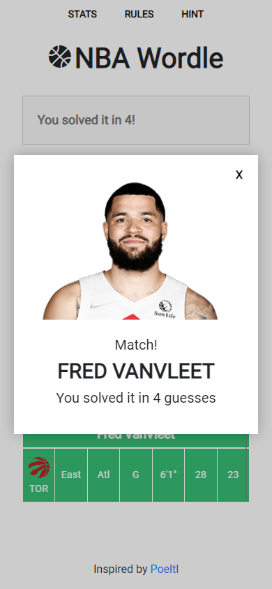
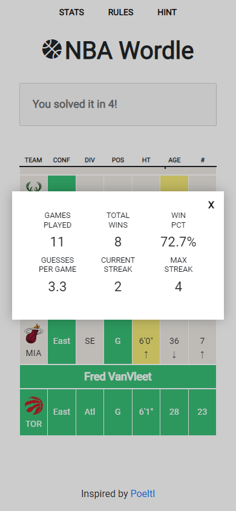

# NBA Wordle

A clone of [Poeltl](https://poeltl.dunk.town/) (an NBA player guessing game) that I built in React.

Play the game [here](https://jywkim.github.io/nba-player-guess/)!

## Screenshots

   

## Installation and Setup Instructions

Clone down this repository. You will need `node` and `npm` installed globally on your machine.  

Installation:

`npm install`  

To Start Server:

`npm start`  

To Visit App:

`localhost:3000/nba-player-guess`  

## Notes

As a basketball fan, I loved playing [Poeltl](https://poeltl.dunk.town/) and I thought it would be fun to build a clone in React. The data used in this project comes from the [endpoints](https://github.com/kshvmdn/nba.js/blob/master/docs/api/DATA.md) described in the [NBA Stats API](https://github.com/kshvmdn/nba.js) Node.js library documentation.